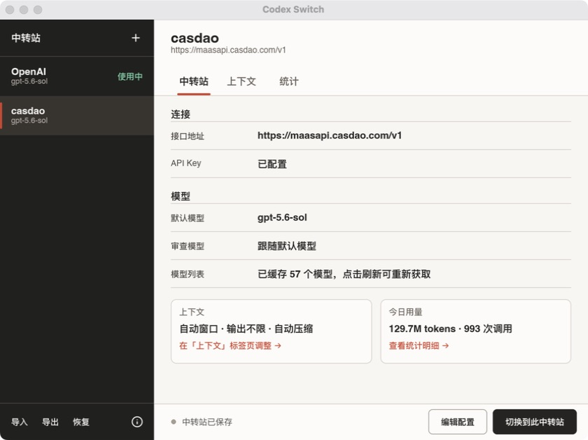
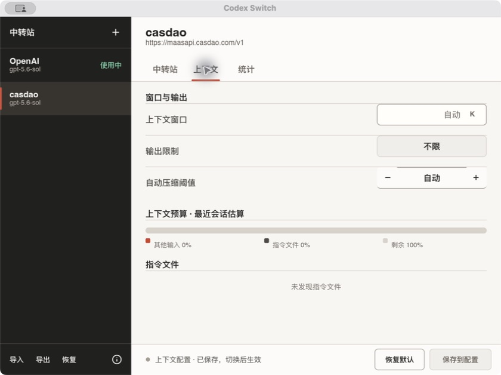
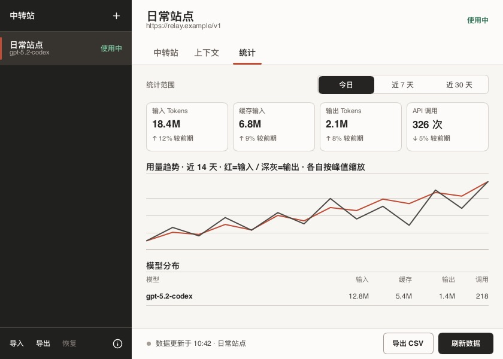

# Codex Switch

Codex Switch 是一个轻量的 Codex 中转站配置切换工具，使用 Rust 和 Slint 构建，支持 macOS 与 Windows。它管理中转站、API key、模型、上下文配置和本地 Token 用量，不试图替代 Codex 的完整配置界面。

## 快速开始

1. 安装 Codex Desktop 或 Codex CLI。首次使用时不需要在浏览器中完成 OpenAI 登录；若已打开 Codex 的登录页，直接退出即可。
2. 打开 Codex Switch，点击“新建中转站”，填写中转服务的接口地址、API key 和默认模型。可选地点击“刷新模型”从服务端读取模型列表。
3. 点击“保存”，再点击“切换到此中转站”。保存只写入 Codex Switch 的本地配置；切换才会更新 Codex 配置。
4. 启动或重新启动 Codex，开始使用已选中转站。

即使 `~/.codex` 尚不存在，第一次切换也会创建所需的 `config.toml` 与 `auth.json`。因此，Codex Switch 不依赖已有的 Codex 会话或登录状态。若某个 Codex Desktop 版本在界面层仍强制账号登录，这是 Desktop 自身的限制，不能由本工具绕过。



### 上下文与统计

“上下文”页可以按中转站设置上下文窗口和自动压缩阈值；恢复默认后，Codex 会使用模型自己的默认值。这里显示的上下文预算是本地参考值，不会限制模型输出。



“统计”页汇总当前用户本机的 Codex 会话记录，可按时间范围查看输入、缓存、输出和调用次数，并导出 CSV。它不读取或展示会话消息正文。



## 功能范围

- 保存多个中转站配置，并通过显式的“应用”操作切换当前配置。
- 从当前 `~/.codex/config.toml` 和 `~/.codex/auth.json` 导入可兼容的中转站。
- 每个中转站分别记住默认模型和可选的 `review_model`。
- 每个中转站可分别设置上下文窗口与自动压缩阈值；切换时一并应用。
- 从本机 Codex 会话日志汇总输入、缓存输入、缓存写入、输出、推理输出、调用次数、近 14 日趋势和模型分布，并支持 CSV 导出。
- 使用 Bearer API key 请求中转站的标准 `GET /models` 接口，缓存模型列表；接口不可用时仍可手动填写模型 ID。
- 导入和导出工具配置。默认导出不包含 API key，只有明确选择后才会带出密钥。
- 应用前保存备份，保留最近 10 份，并提供恢复入口。
- 检测 Codex 相关配置被外部修改的冲突，以及正在运行的 Codex CLI 或桌面应用。

本工具只支持 `auth.json` 中的 `OPENAI_API_KEY` 认证和 Codex 的 Responses wire API。它不管理 OAuth 登录、多种鉴权字段、系统代理、Codex 原生模型目录、托盘常驻、自动更新或完整的 Codex 设置。

## 数据与隐私

工具的数据统一保存在用户家目录的隐藏目录 `~/.codex-switch`：

| 路径 | 内容 |
| --- | --- |
| `~/.codex-switch/profiles.toml` | 中转站、模型、上下文配置和 API key |
| `~/.codex-switch/state.json` | 当前应用状态与冲突检测信息 |
| `~/.codex-switch/model-cache/` | 各中转站最近获取的模型列表 |
| `~/.codex-switch/usage.sqlite3` | 本地 Token 用量索引、统计缓存和已确认的旧版归属时间窗 |
| `~/.codex-switch/backups/` | 应用配置前生成的 Codex 配置备份 |

Token 统计首次读取时会扫描 `~/.codex/sessions/` 与 `~/.codex/archived_sessions/` 下的 JSONL 事件，并把已计算的报表按中转站、时间范围、当地统计窗口和旧版归属时间窗缓存到 `usage.sqlite3`。后续来源文件和统计窗口未变化时直接读取本地索引；文件变化、缓存内容损坏、SQLite 索引损坏或删除数据库时会自动重扫并重建。扫描期间遇到暂时不可读的来源时，该次不完整报表不会写入缓存。数据库只保存来源文件的路径、大小、修改时间、统计结果，以及旧版记录的 profile UUID 和时间边界；不保存消息正文、原始日志行、完整配置或 API key。损坏记录、超大单行和符号链接会被跳过。

这些文件不会额外加密，`profiles.toml` 和备份中的 API key 都是明文。macOS/Unix 上工具会尽量将目录和文件权限分别限制为 `0700` 和 `0600`；Windows 上仍应依赖当前用户账户与磁盘权限保护家目录。不要把 `~/.codex-switch` 提交到 Git、上传网盘或发送给其他人。

## 写入 Codex 的范围

应用中转站时，工具对 `~/.codex/config.toml` 做保留格式的局部修改，只维护以下字段：

```toml
model_provider = "codex_switch_a1b2c3d4e5f6478899aabbccddeeff00"
model = "中转站默认模型"
# 启用审查模型时才存在：
review_model = "中转站审查模型"
# 显式配置上下文时才存在：
model_context_window = 272000
model_auto_compact_token_limit = 217600
model_auto_compact_token_limit_scope = "total"

[model_providers.codex_switch_a1b2c3d4e5f6478899aabbccddeeff00]
name = "中转站名称"
base_url = "https://relay.example/v1"
wire_api = "responses"
requires_openai_auth = true
```

同时只更新 `~/.codex/auth.json` 的 `OPENAI_API_KEY`。其他 Codex 配置、其他 provider 和 `auth.json` 中的其他字段会保留。禁用审查模型时，工具会移除自己管理的顶层 `review_model`；上下文恢复默认时会移除上述三个上下文字段，让 Codex 使用模型默认值。

Codex 配置没有生成输出 Token 上限字段，因此本工具不会写入或人为限制最大输出 Token。实际响应仍受所选模型和中转服务自身能力约束。

模型刷新会把中转站的 `base_url` 规范化后请求其 `/models` 路径，并发送 `Authorization: Bearer <OPENAI_API_KEY>`。工具不会自动轮询；刷新由用户触发，成功结果缓存在本地。

每个中转站使用稳定且独立的 `model_provider` ID，统计页按当前选中的中转站筛选本地会话日志。输入和输出趋势以两条折线显示，并各自按区间峰值缩放，便于观察变化；统计卡片显示所选日期的单日输入、缓存输入、输出和调用数，鼠标移入图表会同步切换到对应日期。模型表与单独的“近 7 天/近 30 天总计”区域明确显示所选范围的汇总，避免把周期总数误读为单日用量。升级前由共享 `codex_switch` ID 写入的历史日志会根据本机已校验的切换备份和会话配置段保守恢复归属；首个可验证切换点之前、损坏快照附近或无法证明归属的记录会显示为“迁移前共享调用未归属”，不会计入任何中转站。重新切换一次中转站后，新会话会开始按独立 ID 精确记录。标准 `/models` 响应也不包含中转站费率，因此界面不估算费用，避免把公开模型价格误当成中转站账单。上下文预算中的指令 Token 按文件字节数近似估算，属于本地参考值。

## 切换安全

中转站编辑器中的“保存”只更新 `~/.codex-switch/profiles.toml`；“应用”会修改 `~/.codex/config.toml` 和 `~/.codex/auth.json`。在当前已应用的中转站上保存上下文时，工具会通过同样的备份、校验和回滚流程立即同步 `config.toml`，让新会话生效；未应用中转站的上下文会在下次切换时写入。

每次应用都会先校验配置、生成备份，再原子替换目标文件。工具会优先使用 Codex Desktop 随附的 Codex 可执行文件，也会检查常见安装路径与 `PATH`；若未找到可执行校验器，则只执行内置结构校验，并在界面中明确显示降级警告。Codex++、cc-switch 等外部工具写入相对 `model_catalog_json` 时，校验过程会从真实 Codex 目录只读复制对应模型目录文件到隔离目录，不修改或持久保存原文件。发生写入失败时会尝试回滚；下次启动也会检查未完成事务。工具只对它管理的相关字段做外部变更检测，出现冲突时应在界面中选择导入当前值、覆盖或取消，而不是继续盲写。上下文单独同步发生冲突时，“保留外部并同步”只更新上下文字段，保留工具外刚修改的模型、认证和其他配置。

如果 Codex CLI 或 Codex/ChatGPT 桌面应用仍在运行，它可能已经把旧配置加载到内存，也可能在退出时再次写文件。工具会先给出风险提示，并在支持的平台上请求桌面应用正常退出和重新启动；无法可靠识别或关闭时，需要用户明确确认。不要在正在执行的重要 Codex 任务中强制切换。

备份只用于恢复 Codex 的 `config.toml` 和 `auth.json`，恢复操作同样会覆盖当前对应文件。删除一个工具配置不会自动修改当前已应用的 Codex 配置。

## 安装

发布产物按平台生成：

- macOS：`Codex Switch.app` 和 `.dmg`。
- Windows：NSIS `.exe` 安装器，默认安装到当前用户范围，不要求为所有用户安装。

macOS 发布包在最终写入资源后使用临时签名校验其完整性，但没有 Apple Developer ID 证书。Gatekeeper 或 Windows SmartScreen 仍可能显示来源提示；请只运行自己构建或来自可信发布渠道的产物。macOS DMG 不要求接受单独的安装条款；将 `Codex Switch.app` 拖到“应用程序”后，弹出安装磁盘，再从“应用程序”启动即可。

面向组织外部发布 macOS 安装包时，应使用 Apple Developer ID 签名并向 Apple 公证 DMG。当前公开 Release 没有配置这类凭据，适合已确认来源的内部使用，不应宣称为已公证发行版。

## 本地开发

需要 Rust 1.92 或更高版本，以及当前平台的 Rust 原生构建工具链。

```bash
cargo run
cargo test
cargo build --release
```

应用只读写当前用户家目录下的 `~/.codex` 和 `~/.codex-switch`。开发测试前建议先备份真实的 `~/.codex/config.toml` 与 `~/.codex/auth.json`。

## 打包

打包使用 `cargo-packager` 0.11.8：

```bash
cargo install cargo-packager --version 0.11.8 --locked
cargo packager --release
```

原生安装包应在对应目标系统上构建，默认输出到 `target/release/`。配置中的 `formats = ["default"]` 在 macOS 上生成 `.app` 与 `.dmg`，在 Windows 上生成 NSIS 安装器。Windows 安装器使用 `currentUser` 模式。macOS 打包后还需要运行 `scripts/normalize_macos_dmg.sh target/release/*.dmg`，以清除安装盘的应用图标，避免 Finder 在卷图标上叠加状态标识。

GitHub Actions 在 macOS 和 Windows 上执行格式检查、Clippy、测试和原生打包，并分别上传 `.dmg` 与 `.exe` 构件。手动运行工作流或推送 tag 时，也会保留对应平台的安装包供下载。

## 许可

Codex Switch 使用 [MIT License](LICENSE)。[简体中文译文](LICENSE.zh-CN.txt) 用于阅读，英文文本为权威版本。Slint 和 Lucide 图标的许可及归属说明见 [THIRD_PARTY_LICENSES.md](THIRD_PARTY_LICENSES.md)。应用顶部可访问的“关于”界面包含 Slint 的 `AboutSlint` 组件，用于满足所选 Slint royalty-free 许可的署名条件。
